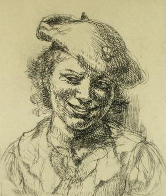
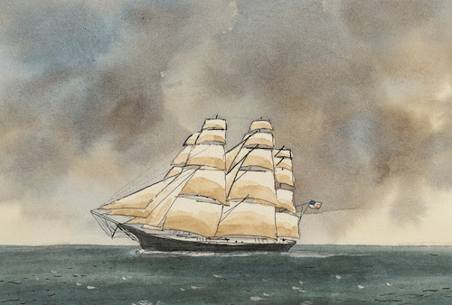
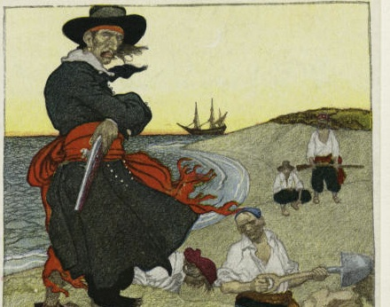

## Setting

Story occurs in a fictionalized time and place, approximately equivalent to the year 1722. The differences being the location names, and the lack of sexism or racism (and if you notice any of either - please let me know!).

Pirates are plentiful in this land. The local governments have not been powerful enough to protect ships from their attacks.

## Captain Z

Full name: Captain Sophia Zephyr

Captain of the ship the Wind Drinker.

### Backstory

Captain Z is 22 years old. An orphan. She was born in the Port of Goodnews, and was cared for by Dr. Star at her orphanage/school since the age of 3.

Potential history:

 - Was part of Dr. Star's first class at the boarding school
 - 3 other kids were part of this first class, making 2 boys and 2 girls
 - stays nearly 3 years with Dr. Star
 - Age 10, goes to work on a merchant ship
 - Switches to pirate ship when merchant ship is attacked
 - 15 years old when she joins the crew of the Wind Drinker
 - Wind Drinker's original captain is a woman - "Captain Crown" ? (from Zia)
 - Captain and Sophia become close friends in a short amount of time
 - Original captain retires and leaves ship to Sophia - making her Captain Z.
 - Rest of the crew mutinies and attempts to take control of the ship
 - Captain Z wins the ship but looses the crew.
 - Goes back to Port of Goodnews to fix up ship
 - blacksmith friend - who was also part of original Dr Star class - mechanizes ship to make it runnable by single person
 - captain z goes out to pursue castle island treasure

### Description

Here is the description of her face, from the book:

> The little lamp she held gave a glimpse of her face. A jagged scar ran across it. Starting at the left ear, it painted a crooked Z across her cheek, ending at her nose. She held up a map for a closer look at the markings on it.

> Her mouth was turned down in a deep frown of concentration. Her eyes looked like two pieces of coal, black and smoldering, as they stared down at the scrap of paper.

She also wears a feathered hat of some sort - something piratey.

### Potential Inspiration

### Muddle the Crow

Her pet trained crow.

From the book:

> Captain Z had rescued the crow when it was just a baby. Blown out to sea and tossed among the waves, Captain Z had found the little Muddle in an empty bread basket. She raised her on fish, clams, and shrimp, and had taught it all manner of tricks and skills.

> The name Muddle came from the crows bad luck. It just as often messed things up as make them better, but Captain Z loved her just the same.

## Wind Drinker

Captain Z's boat. She served as a shipmate aboard under the previous captain before inheriting it. When Captain Z took over, the rest of the crew mutinied. Captain Z kept the ship, but lost the crew.

Afterwards, Captain Z had the boat retro fitted with pulley systems and gearing to allow her to setup and sail the boat singlehandedly.

### Potential Inspiration

## The Dread Captain Spears

Captain of the ship the Sea Breaker.

### Description

He's older, perhaps 50, with a beard. Traditional pirate look.

Glowing eye:

One of his eyes glows red, and can change color depending on his mood.

From the book:

> Of course this is to say nothing of Captain Spears's evil red eye.

> Some people said it was a magic eye, and could kill a man with only a glare. Others said that Spears was cursed by a foul witch, and the eye was markings of that spell. Others said that he couldn't see a wink out of it at all, a blindness caused by a run in with a poisonous jellyfish when he was just a child.

> No one knew who was right or wrong about Captain Spears and his eye. But it did seem to glow in the night, like the flame from a candle. And at times it changed color, from red to yellow, or even blue.

> The eye only added to the fearfulness other pirates felt when they spoke of Captain Spears.

The eye allows Spears to see in the dark. It also can zoom in like a telescope or microscope.

### Crew and Cat

Has a few named pirates on his crew:

Old Jon Thumb: older man. Missing one of his thumbs.

Sally Snake Eye: middle aged woman. Only one eye.

Golden George: younger man.

Barnacle Bill: the dumb one.

Smelly Ned: smelly.

Cinnamon: the cook.

Hissy is his cat.

### Potential Inspiration

## Dr. Star

Older lady. Similar age as Captain Spears. Captain Z's teacher and mentor as she grew up in Port Goodnews. Dr. Star started the school for orphans that Captain Z attended and returns to in the book. Patient, kind.

## Kids

Current residents of Dr. Star's school. 3 of them: Orion, Nova, and Lucy (stars!). Lucy is the youngest at 5.

Nova and Orion are brother and sister. Nova is older, I think 9. Orion is 8. Something like that. They end up going with Captain Z to become adventurer sailors at the end of the book.
