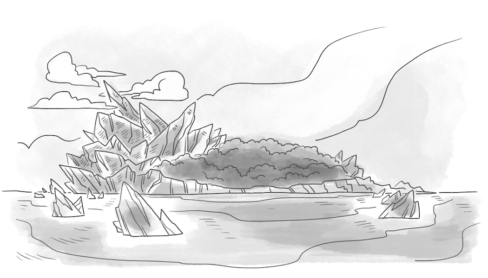

## 1

Our story begins, as most pirate stories do, in the dark. 

The low glow of a lamp, running out of oil, is the only light about. The stars and moon covered by the angry clouds of a dark and stormy sky. 

This lamp shines its light on a little dirt path between the rocks. The path goes up through the cliffs of a forlorn and bare little rock of an island. The cliffs, the rocks, the path, and a few palm trees are about the only things on this island - apart from the treasure, that is.

And it is because of this treasure that our pirate friend is here on this little island tonight as well. Though friend might not be the word to use for such a terrible figure as this one.

The little lamp she holds gives us a glimpse at her face. A jagged scar runs across it - starting at the left ear and painting a crooked Z through the nose, before ending at the other side of her chin. 

Her mouth is turned down in a deep frown. Her eyes, look like two pieces of coal - black and smoldering - as they stare out into the darkness. 

And of course, her grand feathered captains hat covers her matted brown hair - dirty and braided into knots and hooks. 

This is our hero, as it were: Captain Sophia Zephyr.

Though Captain Z doesn't start this tale as a hero. She starts it, as you might expect from such a story, as a pirate! An especially mean and especially terrible, no-good villain of a pirate. 

But, there is a chance she might not stay that way. 

Let's look, listen, and find out. 

## 2

Captain Z rests for a bit on one of the large rocks along the steep path she's been following and checks the map in her hand. She makes sure she is still on the right path, and then continues trudging up the mountain. 

The map is a treasure map, showing the route up these rocky cliffs of Castle Island. 

The path she is taking leads to an X on the map, and you know that X marks the spot. The spot of the treasure that Captain Z is hoping to find and escape with before she is found out herself. 

You see, Captain Z is not the only pirate walking about on this island in the middle of a dark and stormy night. The Dread Captain Soots and his crew of scoundrels are searching and scouting on on that island too. Except they don't have the treasure map, you see, as Captain Z has stolen it from them, so they can't be searching for treasure. Instead, they are searching for her!

## 3

Earlier, this same night, things were a different story altogether. 

The Dread Captain Soots had the treasure map of Castle Island all locked up and safe on his ship _The Sea Breaker_. At least he thought it was locked up safe.

But he probably wouldn't have thought that if he knew Captain Zephyr was on her way to take it from him. 

_The Sea Breaker_ was moored up a stones throw from Castle Island. Captain Soots' plan was for he and his pirate crew to get a good night's sleep, and then have the whole next day to search for the treasure shown on his map. He had even made his crew go to bed early, much to their grumbling and complaining. 

But as he and his crew were putting on their pajamas, a little boat slowly and quietly rowed its way toward their mighty pirate ship. 

Captain Z was the only person in that little row boat, along with a hook and rope, her lamp, and of course her grand feathered captains hat. 
As the sky darkened into night, Captain Z rowed right up to the side of that big pirate ship. Swinging her hook and rope around, she threw it up and snagged the hook around the rail. Then Captain Z was up on the top deck - quick as a wink and quiet as a mouse. 

She tiptoed across the deck, toward the door leading below deck. Carefully, she skipped over squeaky looking planks and tangles of rope that might trip her up. 

The door gave a little squeak as she opened it, but not one of those scoundrel pirates stirred as Sophia slipped below deck. 

## 4

What a commotion those pirates make when they are sleeping!

There was enough snoring down here to make you believe that someone really was sawing through lumber - as the expression goes. 

Captain Z crept past the loud open bed rooms and shuffled into the cluttered and crowded map room. There were maps everywhere. They covered the tables and were rolled up and scattered on the floor. Maps stuck out of vases and pots and pans. They hung on every inch of the walls.
